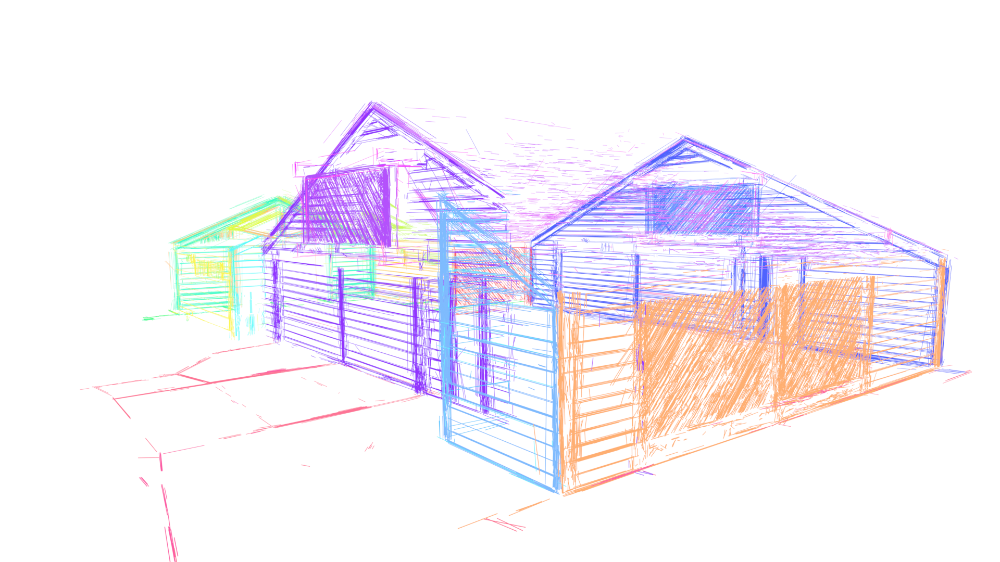
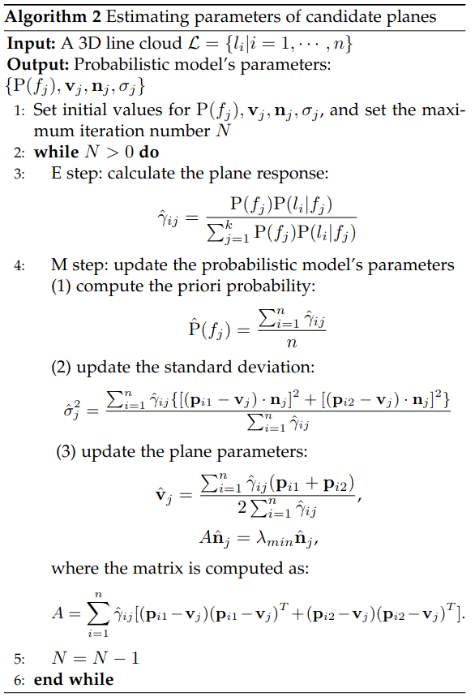

# Plane reconstruction from 3D lines

### Overview

This is the code repository implementing the "plane reconstruction from 3D lines" part of the paper "Surface Reconstruction from Multi-view Line Cloud".

### Input
3D line segments set, obj file.

### Output
Planes fitting lines, vg file.

### Algorithm Detail
It can be resolved as a clustering problem like GMM(Gaussian Mixture Model), using Bayes theorem, assume
the probablity of lines is decided by probability of planes and conditional 
probability of lines giving plane.

Here I give the details of obtaining the candidate planes ($\{f_1,f_2,\cdots,f_k\}$, where $k$ is unknown)
from a given set of 3D line segments $\mathcal{L}=\{l_1,l_2,\cdots,l_n\}$. 

#### Geometry representation
For a given line segment, I use the 2 end points to represent it as follow:
$$
l=\mathbf{p}_1:(x_1,y_1,z_1)\rightarrow \mathbf{p}_2:(x_2,y_2,z_2) \,\text{.}
$$
As for a plane, I use a point in the plane and the normal to represent it:
$$
f=\{\mathbf{v}:(a,b,c),\,\mathbf{n}:(n_x,n_y,n_z)\} \,\text{.}
$$
#### Probability modeling
Assume you already know the $k$ which indicates the number of planes and the probability distribution of those
planes: $\mathrm{P}(f_1),\mathrm{P}(f_2),\cdots,\mathrm{P}(f_k),\,\sum_{j=1}^k\mathrm{P}(f_j)=1$\,. 
Additionally, I give the conditional probability hypothesis:
$$
\mathrm{P}(l\,| f_j)=\frac1{\sqrt{2\pi}\sigma_j}\exp\{{-\frac{[(\mathbf{p}_1-\mathbf{v}_j)\cdot \mathbf{n}_j]^2+[(\mathbf{p}_2-\mathbf{v}_j)\cdot \mathbf{n}_j]^2}{2\sigma_j^2}}\}
$$
. Then, you can get the joint probability distribution of the line segment  $l$ and the plane $f_i$ by using Bayes' theorem:
$$
\mathrm{P}(l, f_j)=\mathrm{P}(l\,|f_j)\mathrm{P}(f_j)\,\text{.}
$$
The marginal probability is exactly the probability that the line $l$ occurs:
$$
\mathrm{P}(l)=\sum_{j=1}^k\mathrm{P}(l\,|f_j)\mathrm{P}(f_j)\,\text{.}
$$
Since you get the probability of each sample line segment and each sample is regarded independent, you will maximize the likelihood function $\mathrm{P}(D|\theta)$ to get parameters of each plane $f_j$:
$$
\max \prod_{i=1}^{n} \mathrm{P}(l_i)\,\text{.}
$$
Here I use $\theta$ to denote all parameters in the likelihood function of parameterized model.

#### Parameters estimation
Since product of probabilities cost too much, I use log-likelihood instead:
$$
\ln[\mathrm{P}(D|\theta)]=\sum_{i=1}^n\ln[\mathrm{P}(l_i|\theta)]=\sum_{i=1}^n\ln[\sum_{j=1}^k\mathrm{P}(l_i|f_j,\theta_j)\mathrm{P}(f_j)]\,\text{.}
$$
In order to calculate the likelihood, I use a implicit variable $\gamma_{ij}$ to indicate which plane $f_j$ the line $l_i$ belongs to.
$$
\gamma_{ij}=
\begin{cases}
\begin{aligned}
1,& \quad l_i\in f_j\\
0,& \quad otherwise
\end{aligned}
\end{cases}
$$
So the complete likelihood function can be written as:
$$
\begin{aligned}
\mathrm{P}(l,\gamma|\theta)=&
\prod_{i=1}^n\mathrm{P}(l_i,\gamma_{i1},\gamma_{i2},\ldots,\gamma_{ik}|\theta)\\=&
\prod_{i=1}^n\prod_{j=1}^k\left[\mathrm{P}(l_i|f_j,\theta_j)\mathrm{P}(f_j)\right]^{\gamma_{ij}}\\=&
\prod_{j=1}^k\mathrm{P}(f_j)^{c_j}\prod_{i=1}^n\left[\mathrm{P}(l_i|f_j,\theta_j)\right]^{\gamma_{ij}}\\=&
\prod_{j=1}^k\mathrm{P}(f_j)^{c_j}\prod_{i=1}^n\left[\frac1{\sqrt{2\pi}\sigma_j}\exp\left({-\frac{((\mathbf{p}_{i1}-\mathbf{v}_j)\cdot \mathbf{n}_j)^2+((\mathbf{p}_{i2}-\mathbf{v}_j)\cdot \mathbf{n}_j)^2}{2\sigma_j^2}}\right)\right]^{\gamma_{ij}}
\end{aligned}
$$
where $c_j=\sum_{i=1}^n\gamma_{ij}$. Then the log-likelihood function on data $D$ is below:
$$
\ln\mathrm{P}(l,\gamma|\theta)=\sum_{j=1}^k\left\{c_j\ln \mathrm{P}(f_j)+\sum_{i=1}^n\gamma_{ij}\left[\ln\frac{1}{\sqrt{2\pi}\sigma_j}-\frac1{2\sigma_j^2}\left(((\mathbf{p}_{i1}-\mathbf{v}_j)\cdot \mathbf{n}_j)^2+((\mathbf{p}_{i2}-\mathbf{v}_j)\cdot \mathbf{n}_j)^2\right)\right] \right\}
$$
Because the likelihood function contains implicit variable, I use EM algorithm to solve the maximum problem. In the expectation stage, let
$$
\begin{aligned}
\mathrm{Q}(\theta,\theta^{(m)})=&\mathcal{E}[\ln\mathrm{P}(l,\gamma|\theta)|l,\theta^{(m)}]\\=&
\mathcal{E}\left\{\sum_{j=1}^k\left\{c_j\ln P(f_j)+\sum_{i=1}^n\gamma_{ij}\left[\ln\frac1{\sqrt{2\pi}\sigma_j}-\frac{((\mathbf{p}_{i1}-\mathbf{v}_j)\cdot \mathbf{n}_j)^2+((\mathbf{p}_{i2}-\mathbf{v}_j)\cdot \mathbf{n}_j)^2}{2\sigma_j^2}\right]\right\}\right\}\\=&
\sum_{j=1}^k\left\{\sum_{i=1}^n\mathcal{E}(\gamma_{ij})\ln P(f_j)+\sum_{i=1}^n\mathcal{E}(\gamma_{ij})\left[\ln\frac1{\sqrt{2\pi}\sigma_j}-\frac{((\mathbf{p}_{i1}-\mathbf{v}_j)\cdot \mathbf{n}_j)^2+((\mathbf{p}_{i2}-\mathbf{v}_j)\cdot \mathbf{n}_j)^2}{2\sigma_j^2}\right]\right\}
\end{aligned}
$$
The expectation $\mathcal{E}(\gamma_{ij}|l_i,\theta)$ here is denoted as $\hat\gamma_{ij}$ for convenient which can be compute as:
$$
\begin{aligned}
\hat\gamma_{ij}=&\mathcal{E}(\gamma_{ij}|l_i,\theta)=P(\gamma_{ij}=1|l_i,\theta_j)\\
=&\frac{P(\gamma_{ij}=1,l_i|\theta_j)}{\sum_{j=1}^kP(\gamma_{ij}=1,l_i|\theta_j)}\\=&
\frac{P(l_i|\gamma_{ij}=1,\theta_j)P(\gamma_{ij}=1|\theta)}{\sum_{j=1}^kP(l_i|\gamma_{ij}=1,\theta_j)P(\gamma_{ij}=1|\theta)}\\=&
\frac{P(f_j)P(l_i|f_j,\theta)}{\sum_{j=1}^kP(f_j)P(l_i|f_j,\theta)}
\end{aligned}
$$
With $\hat \gamma_{ij},c_j=\sum_{i=1}^n\hat \gamma_{ij}$, you can easily get the $\mathrm{Q}$ function:
$$
\mathrm{Q}(\theta,\theta^{(m)})=\sum_{j=1}^kc_j\ln P(f_j)+\sum_{i=1}^n\hat \gamma_{ij}\left[\ln\frac1{\sqrt{2\pi}\sigma_j}-\frac{((\mathbf{p}_{i1}-\mathbf{v}_j)\cdot \mathbf{n}_j)^2+((\mathbf{p}_{i2}-\mathbf{v}_j)\cdot \mathbf{n}_j)^2}{2\sigma_j^2}\right]
$$
Next, in the maximum stage, you need maximize the $\mathrm{Q}$ function to get parameters $\theta^{(m)}$ in each iteration. The maximum problem could be formulated as:
$$
\max_{\theta}\,\mathrm{Q}(\theta,\theta^{(m)})\\
\begin{aligned}
s.t. \sum_{j=1}^k\mathrm{P}(f_j)=1
\end{aligned}
$$
In general, I use Lagrange multiplier to convert the constrained optimization problems to Lagrangian function:
$$
\mathcal{L}=\mathrm{Q}(\theta,\theta^{(m)})+\lambda\left[1-\sum_{j=1}^k\mathrm{P}(f_j)\right]\,\text{.}
$$
Then, calculate the partial derivatives of Lagrange function for each parameter. Because the Lagrange function is a convex function, the function reaches maximum when all partial derivatives are 0 values.
As for $P(f_j)$:
$$
\frac{\partial\mathcal{L}}{\partial P(f_j)}=\frac{c_j}{P(f_j)}-\lambda=0\Rightarrow
c_j=\lambda P(f_j)\Rightarrow 
\sum_{j=1}^n c_j=\sum_{j=1}^n \lambda P(f_j)\Rightarrow
\lambda=n\Rightarrow P(f_j)=\frac{c_j}{n}
$$
So you can get:
$$
P(f_j)=\frac{c_j}{n}
$$
For $\sigma_j$, let the partial derivative be 0: 
$$
\frac{\partial \mathcal{L}}{\partial \sigma_j}=\sum_{i=1}^n \hat\gamma_{ij}\frac{((\mathbf{p}_{i1}-\mathbf{v}_j)\cdot \mathbf{n}_j)^2+((\mathbf{p}_{i2}-\mathbf{v}_j)\cdot \mathbf{n}_j)^2-\sigma_j^2}{\sigma_j^3}=0
$$
Then you have:
$$
\sigma_j^2=\frac{\sum_{i=1}^n \hat\gamma_{ij}[((\mathbf{p}_{i1}-\mathbf{v}_j)\cdot \mathbf{n}_j)^2+((\mathbf{p}_{i2}-\mathbf{v}_j)\cdot \mathbf{n}_j)^2]}{\sum_{i=1}^n \hat\gamma_{ij}}
$$
Similarly, let
$$
\frac{\partial\mathcal{L}}{\partial \mathbf{v}_j}=\sum_{i=1}^n\frac{\hat \gamma_{ij}}{\sigma_j^2}[\mathbf{n}_j^T(\mathbf{p}_{i1}-\mathbf{v}_j)\mathbf{n}_j+\mathbf{n}_j^T(\mathbf{p}_{i2}-\mathbf{v}_j)\mathbf{n}_j]=0
$$
Then, you can get:

$$
\begin{gathered}
\frac1{\sigma_j^2}\sum_{i=1}^n\hat\gamma_{ij}\left[\mathbf{n}_j\mathbf{n}_j^T(\mathbf{p}_{i1}+\mathbf{p}_{i2}-2\mathbf{v}_j)\right]=0\\
\Downarrow\\
\frac1{\sigma_j^2}\mathbf{n}_j\mathbf{n}_j^T\left[\sum_{i=1}^n\hat\gamma_{ij}(\mathbf{p}_{i1}+\mathbf{p}_{i2})\right]=\frac2{\sigma_j^2}\mathbf{n}_j\mathbf{n}_j^T\left(\sum_{i=1}^n\hat\gamma_{ij}\right)\mathbf{v}_j\\
\Downarrow\\
\mathbf{v}_j=\frac{\sum_{i=1}^n\hat\gamma_{ij}(\mathbf{p}_{i1}+\mathbf{p}_{i2})}{2\sum_{i=1}^n\hat\gamma_{ij}}
\end{gathered}
$$

Finally, setting the partial derivative as 0, you can get:
$$
\begin{gathered}
\frac{\partial\mathcal{L}}{\partial \mathbf{n}_j}=
-\sum_{i=1}^n\frac{\hat \gamma_{ij}}{\sigma_j^2}[(\mathbf{p}_{i1}-\mathbf{v}_j)^T \mathbf{n}_j(\mathbf{p}_{i1}-\mathbf{v}_j)+(\mathbf{p}_{i2}-\mathbf{v}_j)^T \mathbf{n}_j(\mathbf{p}_{i2}-\mathbf{v}_j)]=0\\
\Downarrow\\
-\frac1{\sigma_j^2}\left\{\sum_{i=1}^n\hat\gamma_{ij}\left[(\mathbf{p}_{i1}-\mathbf{v}_j)(\mathbf{p}_{i1}-\mathbf{v}_j)^T +(\mathbf{p}_{i2}-\mathbf{v}_j)(\mathbf{p}_{i2}-\mathbf{v}_j)^T \right]\right\}\mathbf{n}_j=0
\end{gathered}
$$
For convenient in the late discuss, use matrix $\mathbf{A}$ to denote the matrix in the left of equal sign above:
$$
A=\left\{\sum_{i=1}^n\hat\gamma_{ij}\left[(\mathbf{p}_{i1}-\mathbf{v}_j)(\mathbf{p}_{i1}-\mathbf{v}_j)^T +(\mathbf{p}_{i2}-\mathbf{v}_j)(\mathbf{p}_{i2}-\mathbf{v}_j)^T \right]\right\}
$$
. To solve the linear equation $\mathbf{A}\mathbf{n}_j=0$
, considering the equation may have no non-zero solutions, convert it to an optimization problem:
$$
\min_{\mathbf{n}_j}\Vert A\mathbf{n}_j\Vert
$$
. After adding the constraint of normal $\mathbf{n}_j$,  you can get
$$
\begin{gathered}
\min_{\mathbf{n}_j} \mathbf{n}_j^TA^TA\mathbf{n}_j\\
s.t.\quad \mathbf{n}_j^T\mathbf{n}_j=1
\end{gathered}\,\text{,}
$$
This problem is equal to the Rayleigh quotient problem. Since $\mathbf{A}$ is a semi-positive definite symmetric matrix, $\mathbf{n}_j$ must be the eigenvector corresponding to the minimum eigenvalue that is
$$
\mathbf{A}\mathbf{\hat n}_j=\lambda_{min}\mathbf{\hat n}_j \,\text{.}
$$

The numerical algorithm for estimating plane parameters is given below:


### Dependency
The code is tested on Ubuntu 20.04. To install requirements, use the command below:
```
pip install -r requirements.txt
```


### Usage
use the command below to test the clustering algorithm:
```
python main.py [-h] [--volume VOLUME] [--line_data LINE_DATA] [--out OUT] [--gui GUI] [--sr SR]

```
For more details of options, type the command below:
```
python main.py --help
```

### Test Cases
- DJI_cut.obj; 
  - fa2e5729 chaos <liuyanchao99@gmail.com> on 2019/9/19;
  - Volume(61); 
  - Fitting(0.179), Coverage(0.14), Complexity(0.681); 
  - Fitting(0.288), Coverage(0.124), Complexity(0.588);
- line_segments_3d_clustered_allpics_11_5_18.obj; 
  - 33b375de yanchao <liuyanchao99@gmail.com> on 2021/7/6;
  - Volume(19); 
  - Fitting(0.276), Coverage(0.36), Complexity(0.364);
- timber_house_cut.obj;
  - 86c47bfc 刘彦超 <liuyanchao99@gmail.com> on 2020/10/27;
  - Volume(19);
  - Fitting(), Coverage(), Complexity();
- 20_sub_crop.obj;
  - 43397e68 yanchao <liuyanchao99@gmail.com> on 2021/11/9;
  - Volume(19);
  - Fitting(0.308), Coverage(0.331), Complexity(0.361);
- kejilou_crop.obj;
  - 784c15e9 yanchao <liuyanchao99@gmail.com> on 2021/11/24
  - Volume(11);
  - Fitting(0.205), Coverage(0.338), Complexity(0.456);
- Line3D++_kejilou_cut2.obj;
  - 5d3325c7 yanchao <liuyanchao99@gmail.com> on 2021/11/29
  - Volume(11);
  - Fitting(0.212), Coverage(0.312), Complexity(0.477);
- Barn+haoyu_cut[6,7,8].obj;
  - 75fe17c3 yanchao <liuyanchao99@gmail.com> on 2021/12/31
  - Volume([7,9,2]);
  - Fitting(0.205), Coverage(0.338), Complexity(0.456);
